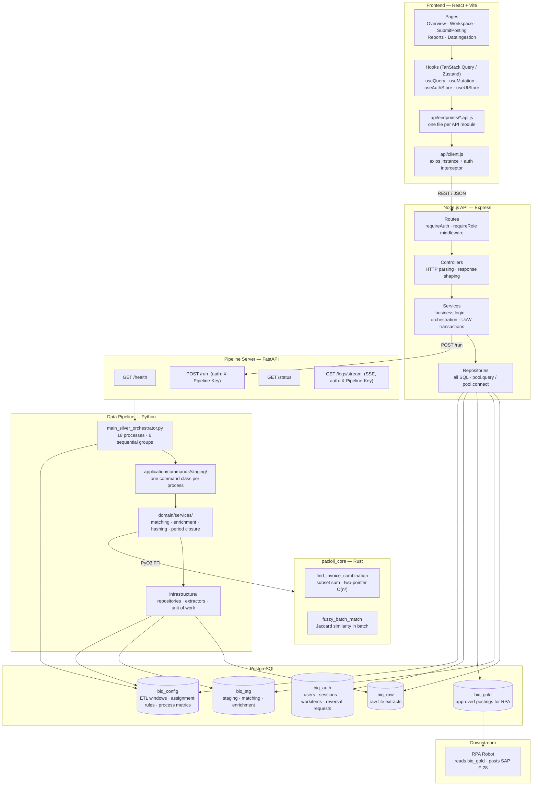
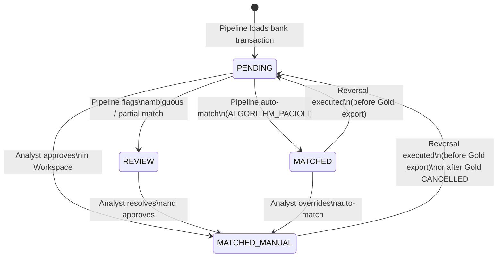
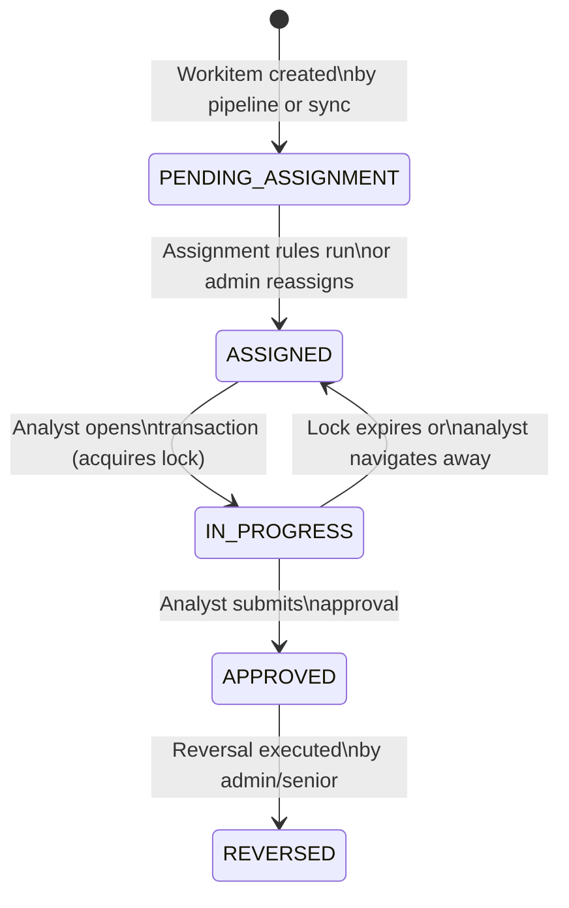
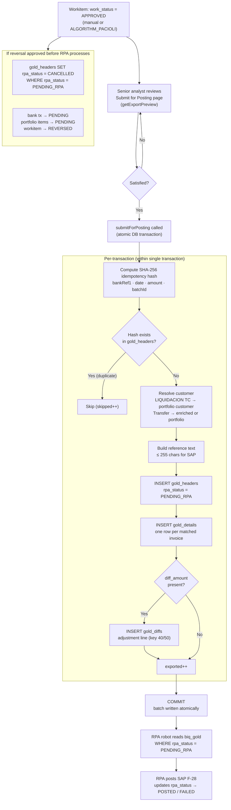

# Architecture Overview

## Table of Contents

1. [System Layers](#system-layers)
2. [Node.js API Module Map](#nodejs-api-module-map)
3. [reconcile\_status State Machine](#reconcile_status-state-machine)
4. [work\_status State Machine](#work_status-state-machine)
5. [Gold Layer Flow](#gold-layer-flow)

---

## System Layers

### Layer responsibilities

| Layer | Owns | Must not |
|-------|------|----------|
| Pages / components | UI state, user interaction | Call DB or business logic directly |
| Hooks | Server state caching, mutation lifecycle | Contain business rules |
| api/endpoints | HTTP call definitions | Import from other modules |
| Controllers | Parse HTTP, shape response, call one service | Contain SQL or business logic |
| Services | Business logic, orchestrate repo calls, manage UoW transactions | Issue HTTP calls |
| Repositories | All SQL | Contain business logic or call other repos |

---

## Node.js API Module Map

| Module | Responsibility |
|--------|---------------|
| `auth` | Login with username/password, issue JWT access + refresh tokens, maintain sessions, verify tokens on all protected routes |
| `assignments` | Apply rule-based auto-assignment of pending transactions to analysts; support manual reassignment by admins |
| `gold-export` | Build and submit the Gold Layer export batch (payment headers, invoice detail lines, diff adjustment lines); return batch history |
| `ingestion` | Accept file uploads, classify files to loaders, write to `data_raw/`, trigger pipeline via Pipeline Server, stream status |
| `locks` | Acquire, renew, and release per-transaction row locks; prevent two analysts from editing the same transaction simultaneously |
| `notifications` | Manage the reversal request workflow — analysts request, admins approve or reject; notify affected parties |
| `overview` | Return daily KPI aggregates and transaction list; sync automatic pipeline matches into workitems |
| `portfolio` | Search customer invoice portfolio; load portfolio items for a given bank transaction; validate analyst selection |
| `reconciliation` | Calculate match balance (gross, net, commission, IVA, IRF, diff); validate and approve manual reconciliations |
| `reports` | Serve 7 parameterized report types (R1 Overview, R2 Bank, R3 Portfolio, R4–R5 Cards, R6 Parking, R7 Summary) with CSV export |
| `reversals` | Execute approved reversals — restore bank transaction and portfolio items to PENDING, cancel Gold entry if not yet RPA-processed |
| `transactions` | List and paginate bank transactions with filters; return transaction detail and status summary counts |
| `users` | Return the analyst directory; used by admin dropdowns for manual reassignment |
| `workspace` | Return per-analyst queue; load the full transaction panel (bank data + portfolio candidates); handle approval submission |

---

## reconcile\_status State Machine

Applies to `biq_stg.stg_bank_transactions`.

### State definitions

| Status | Set by | Meaning |
|--------|--------|---------|
| `PENDING` | Pipeline (initial load); reversal execution | Awaiting reconciliation |
| `REVIEW` | Pipeline matching algorithm | Auto-match attempted but confidence below threshold or partial match |
| `MATCHED` | Pipeline (`ALGORITHM_PACIOLI`) | Fully matched automatically; workitem created and auto-approved |
| `MATCHED_MANUAL` | Analyst approval in Workspace | Manually reconciled and approved by an analyst |

> Portfolio items (`biq_stg.stg_customer_portfolio`) follow a parallel lifecycle. The pipeline sets the initial state on load (`PENDING`), then the enrichment phase updates items it successfully enriched to `ENRICHED` — this is set entirely by the pipeline and has no corresponding API transition. When an analyst approves a reconciliation, all selected items are set to `CLOSED` by the API. `CLOSED` items cannot be selected for a new reconciliation. On reversal, items are restored to `PENDING` regardless of whether they were `ENRICHED` or `CLOSED` at approval time.

---

## work\_status State Machine

Applies to `biq_auth.transaction_workitems`. One workitem exists per bank transaction.

### State definitions

| Status | Set by | Meaning |
|--------|--------|---------|
| `PENDING_ASSIGNMENT` | Pipeline sync; reversal | Created but not yet assigned to an analyst |
| `ASSIGNED` | Assignment rules engine; lock expiry; admin reassignment | Assigned to an analyst; visible in their queue |
| `IN_PROGRESS` | Lock acquisition (analyst opens transaction) | Analyst is actively working; row is locked |
| `APPROVED` | Analyst approval; auto-match sync | Reconciliation approved; eligible for Gold export |
| `REVERSED` | Reversal execution | Approval undone; bank transaction restored to PENDING |

---

## Gold Layer Flow

The Gold Layer converts approved reconciliations into structured SAP F-28 posting records consumed by the RPA robot.

### Gold Layer table structure

| Table | One row per | Key fields |
|-------|-------------|------------|
| `biq_gold.gold_headers` | Bank transaction | `batch_id`, `bank_ref_1`, `amount`, `customer_code`, `rpa_status`, `idempotency_hash` |
| `biq_gold.gold_details` | Matched invoice | `header_id`, `invoice_ref`, `customer_code`, `amount_gross`, `gl_account`, `is_partial_payment` |
| `biq_gold.gold_diffs` | Diff adjustment entry | `header_id`, `diff_amount`, `posting_key` (40 = debit / 50 = credit) |

### Posting key logic

When the bank amount does not exactly equal the sum of matched invoices, a diff adjustment line balances the entry:

| Condition | Posting key | Direction |
|-----------|-------------|-----------|
| Bank overpaid (diff > 0) | 50 | Credit (haber) |
| Bank underpaid (diff < 0) | 40 | Debit (debe) |
