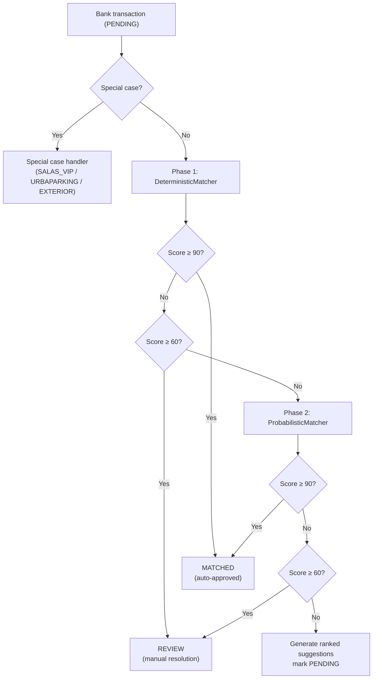
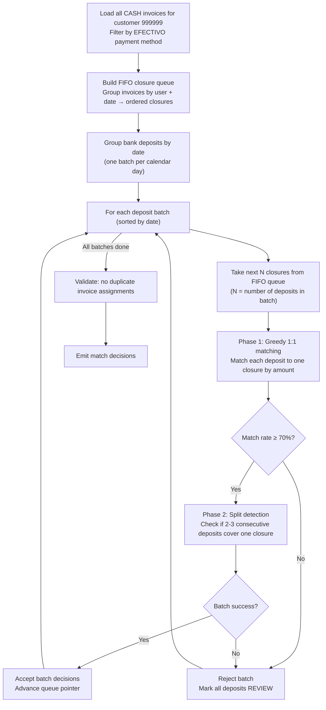

# Pipeline Algorithms

## Table of Contents

1. [Pipeline Execution Model](#pipeline-execution-model)
2. [Matching Algorithms](#matching-algorithms)
3. [Salas VIP Strategy](#salas-vip-strategy)
4. [Enrichment Model](#enrichment-model)

---

## Pipeline Execution Model

The pipeline is invoked by `main_silver_orchestrator.py`. It runs in two top-level phases: Phase 0 loads raw files, then 6 sequential groups run the 18 staging processes. Groups are sequential — each group completes before the next begins. Processes within the same group run in parallel where possible.

### Phase 0 — RAW Loaders

Ten data loaders write raw file extracts to `biq_raw` before any staging process runs:

| Loader | Source |
|--------|--------|
| SAP F-239 | Card settlement summary (SAP) |
| SAP FBL5N | Customer open items (accounts receivable) |
| Webpos | WebPOS transaction log |
| Banco | Bank statement |
| Diners Club | Diners card vouchers + settlements |
| Guayaquil | Banco Guayaquil card vouchers + settlements |
| Pacificard | Pacificard vouchers + settlements |
| Databalance | Card balance reconciliation |
| Retenciones | Withholding certificates |
| Manual Requests | Analyst-entered manual reconciliation requests |

### 6 Sequential Groups

```mermaid
flowchart TB
    P0["Phase 0 — RAW Loaders\n10 sources → biq_raw"]

    subgraph G1["Group 1 — Foundations"]
        G1A["ProcessSAPStaging\nTransform FBL5N open items → stg_customer_portfolio"]
        G1B["ProcessPortfolioCDC\nChange-data-capture: detect new vs existing portfolio rows"]
        G1C["ProcessCustomerPortfolio-F1\nInternal netting pass on portfolio"]
    end

    subgraph G2["Group 2 — Card Ingestion"]
        G2A["ProcessDinersStaging\nVouchers + settlements → stg_card_details / stg_card_settlements"]
        G2B["ProcessGuayaquilStaging"]
        G2C["ProcessPacificardStaging"]
    end

    subgraph G3["Group 3 — Derived"]
        G3A["ProcessParkingBreakdown\nAggregate parking vouchers → stg_parking_pay_breakdown"]
    end

    subgraph G4["Group 4 — Withholdings"]
        G4A["ProcessWithholdings\nLoad and transform withholding certificates"]
        G4B["MatchWithholdings\nMatch withholdings to portfolio invoices"]
        G4C["ApplyWithholdings\nApply matched withholdings, update amounts"]
    end

    subgraph G5["Group 5 — Advanced Portfolio"]
        G5A["ProcessManualRequests\nIngest analyst manual reconciliation requests"]
        G5B["ProcessBankEnrichment\nEnrich bank transactions with SAP customer identity"]
        G5C["ProcessCustomerPortfolio-F2\nEnrich portfolio with Webpos + card data"]
        G5D["ProcessCustomerPortfolio-F3\nFinal portfolio hash generation and status sync"]
    end

    subgraph G6["Group 6 — Final Reconciliation"]
        G6A["ReconcileBankTransactions\nRun full matching cascade → MATCHED / REVIEW / PENDING"]
        G6B["UpdateBankValidationMetrics\nWrite process metrics to biq_config"]
        G6C["ValidatePortfolioMatches\nVerify portfolio consistency post-reconciliation"]
        G6D["RestoreApprovedTransactions\nRe-apply approved workitems to staging"]
    end

    P0 --> G1 --> G2 --> G3 --> G4 --> G5 --> G6
```

### Why Sequential Groups?

Each group depends on the outputs of the previous one:

- Group 2 needs the SAP portfolio in place before enriching card vouchers against it.
- Group 4 needs card settlements (Group 2) to match withholdings correctly.
- Group 5 bank enrichment (G5B) must run after SAP records are staged (G1).
- Group 6 reconciliation reads the fully enriched staging tables written by Groups 1–5.

Running groups in parallel would break these data dependencies.

---

## Matching Algorithms

Reconciliation runs in `ReconcileBankTransactionsCommand.execute()`. It processes two distinct transaction populations before applying general matching.

### Phase 0B — Card Settlement Matching

Card settlements (`trans_type = 'LIQUIDACION TC'`) are processed first and separately by `CardMatcher`. The core business rule is the **golden rule**: one bank settlement = one card batch. The matcher verifies that:

- The bank settlement amount equals the net card settlement amount.
- Voucher counts in the bank match the voucher counts in the card detail files.

Cards that satisfy the golden rule are set to `MATCHED`. Discrepancies in count or amount go to `REVIEW`. This phase runs before general matching because card settlements consume their own invoice pool and must not be double-matched.

### Standard Matching Cascade

All non-card (`trans_type != 'LIQUIDACION TC'`) pending transactions are grouped by customer. For each customer, available invoices are loaded (within 90 days) and the matching cascade runs per transaction:

#### Deterministic Matcher

Runs three strategies in order. Returns the first match found.

| Strategy | Method | How it works |
|----------|--------|--------------|
| **EXACT_SINGLE** | Exact 1:1 | Finds one invoice whose `conciliable_amount` equals the bank amount exactly. Example: bank $1,000.00 → invoice $1,000.00. |
| **EXACT_CONTIGUOUS** | Exact 1:N | Sliding window over invoices sorted by `doc_date` ascending. Accumulates consecutive invoices until sum equals bank amount exactly; prunes early if sum overshoots. Example: bank $1,500.00 → invoice A $1,000.00 + invoice B $500.00. |
| **TOLERANCE_SINGLE** | Tolerance 1:1 | Finds one invoice within ±5% of the bank amount (configurable). Example: bank $100.00 → invoice $100.03 → reason: `PENNY_ADJUSTMENT`. |

Deterministic matches require confidence ≥ 85 to be considered valid.

#### Probabilistic Matcher

Runs when deterministic strategies fail. Four strategies in order:

| Strategy | Method | How it works |
|----------|--------|--------------|
| **GREEDY_SEQUENTIAL** | Accumulated contiguous | Accumulates invoices oldest-first until the running sum is within tolerance of the bank amount. Tolerates rounding across many invoices. |
| **SUBSET_SUM (no gaps)** | Non-contiguous exact | Finds any subset of invoices summing to the target, without skipping positions. |
| **SUBSET_SUM (with gaps)** | Non-contiguous approximate | Same as above but allows up to 3 skipped positions. Each gap applies a 5-point score penalty (max −15). |
| **BEST_EFFORT** | Closest single | Picks the invoice closest in amount. Always produces `REVIEW` regardless of score — forces human validation. |

The scoring engine computes `total_score` from:
- Amount match quality (exact vs. tolerance vs. approximate)
- Date proximity (bank payment date vs. invoice `doc_date`)
- Gap penalty (applied by probabilistic matcher for non-contiguous matches)

Scores ≥ 90 → `MATCHED`; 60–89 → `REVIEW`; < 60 → no match (ranked suggestions generated instead).

#### Residuals Phase

After the main customer loop and an intermediate commit, `ResidualsReconciliationStrategy` runs on `DEPOSITO EFECTIVO` transactions for customer 400419 (URBAPARKING). These are cash deposits not resolved in the main pass, matched against remaining Urbaparking portfolio invoices using a date-window strategy (max 3 days, max 5 invoices).

---

## Salas VIP Strategy

Salas VIP (customer code `999999`) is a single airport concession customer that collects cash from dozens of point-of-sale closures each day. A single bank deposit may correspond to one or several daily closures. The standard 1:1 and subset-sum matchers cannot handle this correctly because closures must not be split across deposits.

**Key constraint**: a deposit belongs to exactly one closure. If a deposit covers multiple closures, all closures in the split must belong to the same physical deposit batch.

### Algorithm (SalasVIPStrategy v11.2)

**FIFO closure queue**: Closures are sorted oldest-first. The queue pointer advances permanently — closures consumed by one batch are never reconsidered. This ensures the oldest closures are matched to the oldest deposits, respecting the natural daily order of cash collection.

**Split detection**: If Phase 1 matches fewer than 70% of deposits in a batch, Phase 2 checks whether 2–3 consecutive deposits within a 10-minute window sum to a single closure amount. All candidate deposits in a split must belong to the same closure user.

**Outcome**: Successful batch decisions are tagged `MATCHED`; deposits where no closure can be assigned go to `REVIEW` for analyst resolution.

### Card Settlement Window (CardWindowCalculator)

Card vouchers are created at point-of-sale but settle with the bank days later. Month-end vouchers from the previous month can appear in the current month's settlement batch. To avoid unmatched settlements, the pipeline uses a 15-day lookback window.

**Example — March 2026 accounting period:**

| Without lookback | With lookback |
|-----------------|---------------|
| Voucher window: 2026-03-01 → 2026-03-31 | Voucher window: 2026-02-15 → 2026-03-31 |
| February 25–28 vouchers not found → settlement unmatched | February 25–28 vouchers included → settlement matched |

The 15-day lookback is deliberately conservative: month-end vouchers take 3–5 days to settle; the 15-day buffer covers SAP accounting closures (days 1–5 of the next month) and any extreme edge cases.

---

## Enrichment Model

Enrichment runs in Group 5 (before reconciliation) and serves two purposes:
1. **Bank enrichment** — attach customer identity to bank transactions (so reconciliation knows which invoice pool to search).
2. **Portfolio enrichment** — attach card and payment details to SAP open items (so amounts and references match what the bank reports).

### Bank Enrichment (ProcessBankEnrichment → BankEnricher)

SAP records carry a `bank_ref_1` field (the bank reference number written by the customer on their wire transfer or card batch). `BankEnricher` joins SAP records to the bank statement on this reference to identify which customer sent each payment.

**Two-level matching strategy:**

| Level | Strategy | Example |
|-------|----------|---------|
| Level 1 | Exact join on `bank_ref_1 = ref_clean` | SAP `bank_ref_1` = `"438649"`, bank ref = `"438649"` → direct match |
| Level 2 | Suffix smart match for orphans | SAP `bank_ref_1` = `"438649"`, bank ref = `"1538438649"` → ends with `"438649"` → match |

Smart matching applies only to unmatched SAP rows whose `bank_ref_1` is ≥ 6 characters. First bank reference found with the matching suffix wins.

After enrichment, each bank transaction carries `enrich_customer_id` and `enrich_customer_name`. Reconciliation uses `enrich_customer_id` to look up the right invoice pool. Unmatched transactions are processed as customer `999999` (Salas VIP pool) or left without a customer if no reference exists.

### Portfolio Enrichment (ProcessCustomerPortfolio-F2/F3 → CustomerPortfolioEnricherService)

SAP open items (FBL5N) contain gross invoice amounts. Before reconciliation, each invoice is enriched with the net amounts, commission, IVA, and IRF fields that the card networks actually deduct. This allows the reconciliation engine to compare net bank amounts against net invoice amounts.

The enricher runs a multi-layer cascade:

| Layer | Name | What it does |
|-------|------|--------------|
| 0 | Internal Netting | Detects SAP debit/credit pairs for the same document and marks them `INTERNAL_COMPENSATED`. Excludes incentives, discounts, and bonifications. |
| 1 | Webpos Enrichment | Joins Webpos transaction records to portfolio invoices by reference, attaching the WebPOS batch, user, and terminal data. |
| 2 | Hash Matching | Generates unique matching hashes from invoice identifiers to detect duplicates and link related documents. |
| 3 | Card Enrichment | Joins card settlement files (Diners, Guayaquil, Pacificard) to portfolio invoices by voucher reference and batch, populating net amounts, commission, IVA, IRF. Status set to `ENRICHED` for successfully matched items. |

The Rust core (`pacioli_core`) accelerates two operations in the enricher:
- `find_invoice_combination` — subset sum search for invoice combinations matching a target amount (O(n²) two-pointer, called when the Python DP fallback would be too slow for large invoice sets).
- `fuzzy_batch_match` — Jaccard similarity scoring in batch, used for reference string matching when exact matches fail.

Items that complete enrichment are set to `ENRICHED`. `ENRICHED` is a pipeline-only state; the API never sets it. At analyst approval time, selected items transition from `ENRICHED` (or `PENDING`) to `CLOSED`.
