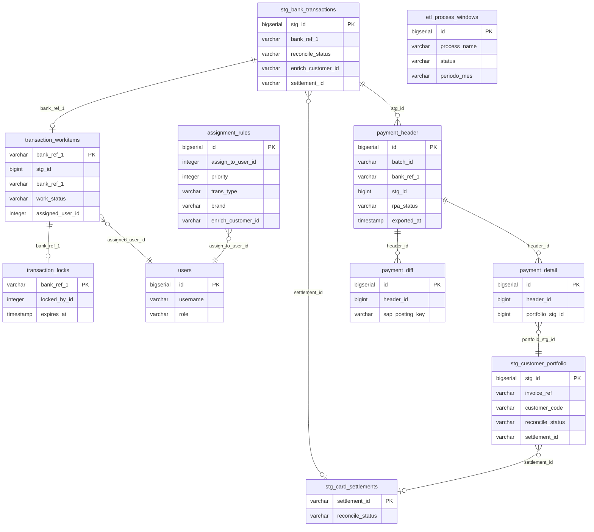

# Data Dictionary

This document describes every table and column across the five PostgreSQL schemas used
by PACIOLI. It is written for analysts, auditors, and developers who need to understand
the data without reading source code.

For each column: business meaning, valid values for enum/status fields, which component
writes the column (Pipeline / API / RPA), and important business rules.

**Database layout:** single PostgreSQL instance, single database (`pacioli`), five schemas.
Cross-schema queries use fully qualified `schema.table` notation. There are no cross-schema
foreign key constraints; referential integrity is maintained by application logic.

---

## Entity Relationship Diagram

> Relationships cross schema boundaries (`biq_stg` ↔ `biq_auth` ↔ `biq_gold`).
> No physical FK constraints exist across schemas. Integrity is enforced by application logic.

---

## Schema: biq_raw

**Owner:** Pipeline
**Access:** Pipeline read/write only. Analysts and the API do not query these tables.

Contains raw data extracted from source files before any transformation. Records are
written once by the 10 RAW loaders at the start of every pipeline run and are never
modified after initial load.

### Tables

| Table | Source |
|---|---|
| `raw_bank_transactions` | Bank statement export files |
| `raw_sap_transactions` | SAP general ledger document export |
| `raw_diners_vouchers` | Diners card voucher files |
| `raw_visa_vouchers` | Visa card voucher files |
| `raw_mastercard_vouchers` | Mastercard voucher files |
| `raw_amex_vouchers` | American Express voucher files |
| `raw_pacificard_vouchers` | Pacificard voucher files |
| `raw_card_settlements` | Card network settlement batch files |
| `raw_parking_breakdown` | Parking payment detail files |
| `raw_withholdings` | Tax withholding records |

> Raw tables mirror source file formats and are consumed only by pipeline staging
> processes. Column-level documentation is not provided here because raw tables
> are not accessed by analysts or auditors. Use `biq_stg` for all analytical queries.

---

## Schema: biq_stg

**Owner:** Pipeline (writes) + API (reads; updates selected columns)
**Access:** Pipeline has full read/write. API has read-all + targeted UPDATE rights on
`reconcile_status` and `work_status` transitions.

The primary working schema. The pipeline transforms and enriches source data here; the
API serves this data to the analyst workspace. `biq_stg` is the shared boundary between
pipeline and API — both components must agree on column contracts. A column rename or
type change requires coordinated migration.

### Tables

| Table | Primary Writer | Primary Reader | Description |
|---|---|---|---|
| `stg_bank_transactions` | Pipeline | API | One row per SAP bank document line eligible for reconciliation. Central table. |
| `stg_customer_portfolio` | Pipeline + API | API | One row per open SAP invoice. Matched against bank transactions. |
| `stg_card_settlements` | Pipeline | Pipeline + API | One row per card network settlement batch. Reconciled via Golden Rule (Phase 0B). |
| `stg_card_details` | Pipeline | Pipeline | Individual card vouchers enriched with batch and settlement data. |
| `stg_parking_pay_breakdown` | Pipeline | Pipeline | Parking payment lines per batch. |
| `stg_withholdings` | Pipeline | API | Tax withholding documents linked to bank transactions. |
| `audit_bank_reconciliation` | Pipeline | API | Append-only audit log for each reconciliation event. |

---

### stg_bank_transactions

The most important table in the system. One row per SAP bank document line eligible for
reconciliation. The pipeline enriches and matches each row; analysts review and approve in
the workspace; the API exports approved rows to the Gold Layer.

**Primary writer:** Pipeline (insert + enrichment columns)
**Secondary writer:** API (`reconcile_status`, `reconciled_at`, `matched_portfolio_ids`,
`enrich_customer_id`, `enrich_customer_name`, `match_confidence_score`, `match_method`
on manual approval)

| Column | Type | Description | Valid Values / Notes |
|---|---|---|---|
| `stg_id` | `bigserial` | Surrogate primary key. Auto-generated on insert. | PK; never reused |
| `etl_batch_id` | `varchar` | Pipeline run identifier that loaded this row. Format: `YYYYMMDD-NNN`. | Written by Pipeline |
| `source_system` | `varchar` | Origin data source label. | e.g. `'SAP'` |
| `doc_date` | `date` | SAP document date. Primary date used for period filtering. The pipeline uses this to scope delta loads. | Written by Pipeline |
| `posting_date` | `date` | SAP posting date. May differ from `doc_date` by one day. | Written by Pipeline |
| `doc_number` | `varchar` | SAP document number. Copied to `payment_header.transaction_sap` on Gold export for RPA identification. | Written by Pipeline |
| `doc_type` | `varchar` | SAP document type. Only `ZR` and `SA` documents appear in the analyst workspace and are eligible for Gold export. | `ZR` = bank reconciliation; `SA` = miscellaneous posting |
| `doc_reference` | `varchar` | SAP reference field from the document header. | Written by Pipeline |
| `amount_total` | `numeric` | Transaction amount in the transaction currency. Always positive; direction is indicated by `amount_sign`. | Written by Pipeline |
| `amount_sign` | `varchar` | Credit or debit direction. | `'+'` or `'-'` |
| `currency` | `varchar(3)` | ISO 4217 currency code. | e.g. `'USD'` |
| `sap_description` | `varchar` | SAP document description field. Used as a fallback join key when `bank_ref_1` is blank (common for TRANSFER transactions). | Written by Pipeline |
| `bank_date` | `date` | Date the transaction appeared on the bank statement. Populated by BankEnricher Level 1 (exact join on `bank_ref_1`). | Written by Pipeline |
| `bank_ref_1` | `varchar` | Primary bank reference. **The central join key** used in workitem lookups, lock checks, and Gold export. May be null for TRANSFER transactions; `sap_description` is used as fallback in those cases. | Written by Pipeline |
| `bank_ref_2` | `varchar` | Secondary bank reference from the bank statement. | Written by Pipeline |
| `bank_description` | `varchar` | Description from the bank statement line. | Written by Pipeline |
| `bank_office_id` | `varchar` | Bank branch/office identifier. | Written by Pipeline |
| `trans_type` | `varchar` | Transaction classification. Drives enrichment path and assignment rule matching. | `TRANSFER`, `CARD_SETTLEMENT`, `CARD_DINERS`, `CARD_VISA`, `CARD_MASTERCARD`, `CARD_AMEX`, `CARD_PACIFICARD` |
| `global_category` | `varchar` | High-level debit/credit direction. | `CREDITO`, `DEBITO` |
| `brand` | `varchar` | Card brand for card-type transactions. Used in assignment rules to route workitems to the correct analyst. Null for non-card transactions. | `VISA`, `MASTERCARD`, `AMEX`, `DINERS`, `PACIFICARD`, or `null` |
| `batch_number` | `varchar` | Card batch number from the settlement file. Links to `stg_card_details.batch_number`. | Written by Pipeline (card enrichment) |
| `settlement_id` | `varchar` | Card settlement identifier. Links to `stg_card_settlements.settlement_id`. Populated during Phase 0B. | Written by Pipeline |
| `establishment_name` | `varchar` | Establishment name from card data. | Written by Pipeline |
| `match_hash_key` | `varchar` | SHA hash of document fields used for deduplication across pipeline runs. When the pipeline re-runs for a period, existing reconciliation state is preserved by matching on this hash rather than re-inserting. | Written by Pipeline |
| `is_compensated_sap` | `boolean` | True if this transaction was offset by an SAP compensation document (same-day debit/credit pair of equal amount). Excluded from analyst workspace and Gold export. | Written by Pipeline |
| `is_compensated_intraday` | `boolean` | True if this transaction was offset by an intraday compensation pair detected by the pipeline. Excluded from workspace and Gold export. | Written by Pipeline |
| `reconcile_status` | `varchar` | **Primary reconciliation status.** Drives workspace visibility and Gold export eligibility. | `PENDING` = needs matching; `REVIEW` = pipeline suggested a match, analyst must confirm; `MATCHED` = pipeline-confirmed high-confidence match; `MATCHED_MANUAL` = analyst-approved |
| `reconcile_reason` | `varchar` | Code that explains how the current status was reached. | `EXACT_SINGLE`, `EXACT_CONTIGUOUS`, `TOLERANCE_SINGLE`, `GREEDY_SEQUENTIAL`, `SUBSET_SUM`, `BEST_EFFORT`, `MANUAL_MATCH`, `NO_PORTFOLIO_DATA`, `CARD_GOLDEN_RULE` |
| `match_method` | `varchar` | Specific algorithm method used. Stored separately from `reconcile_reason` for analytical queries. | Written by Pipeline / API |
| `match_confidence_score` | `numeric` | Confidence score 0–100 from the matching algorithm. ≥90 → MATCHED; 60–89 → REVIEW; <60 → no automatic match. Set to 100 on manual analyst approval. | Written by Pipeline / API |
| `diff_adjustment` | `numeric` | Amount difference between the bank transaction and the sum of matched invoices at the time of pipeline matching. Positive = bank overpaid; negative = bank underpaid. For manual approvals, the authoritative signed diff is stored in `transaction_workitems.diff_amount`. | Written by Pipeline |
| `enrich_customer_id` | `varchar` | Customer code identified during pipeline enrichment. Used by assignment rules. Can be overridden by the analyst during manual approval. | Written by Pipeline / API |
| `enrich_customer_name` | `varchar` | Customer name from enrichment. Denormalized for display. | Written by Pipeline / API |
| `enrich_confidence_score` | `integer` | Confidence score (0–100) for the customer identification. | Written by Pipeline |
| `enrich_inference_method` | `varchar` | Method used to identify the customer. | e.g. `EXACT_HASH`, `FUZZY_MATCH`, `WEBPOS`, `BANK_ENRICHER` |
| `enrich_notes` | `varchar` | Human-readable notes from the enrichment process. Explains why a customer was identified or why enrichment could not determine a customer. | Written by Pipeline |
| `count_voucher_bank` | `integer` | Number of card vouchers in the bank settlement batch. | Written by Pipeline |
| `count_voucher_portfolio` | `integer` | Number of card vouchers matched in the portfolio. Used by the Golden Rule validation to verify counts match. | Written by Pipeline |
| `final_amount_gross` | `numeric` | Gross settlement amount before commission and taxes. | Written by Pipeline (card enrichment) |
| `final_amount_net` | `numeric` | Net amount after commission and taxes are deducted. | Written by Pipeline |
| `final_amount_commission` | `numeric` | Commission charged by the card network. | Written by Pipeline |
| `final_amount_tax_iva` | `numeric` | IVA (value-added tax) withheld from the settlement. | Written by Pipeline |
| `final_amount_tax_irf` | `numeric` | IRF (income retention tax) withheld from the settlement. | Written by Pipeline |
| `matched_portfolio_ids` | `jsonb` | JSON array of `stg_customer_portfolio.stg_id` values matched to this transaction by the pipeline. Overwritten by `approved_portfolio_ids` from the workitem on manual approval. | Written by Pipeline / API |
| `bank_ref_match` | `varchar` | The specific bank reference used for the match (may differ from `bank_ref_1` in suffix-match cases where BankEnricher Level 2 matched on a suffix). | Written by Pipeline |
| `alternative_matches` | `jsonb` | JSON array of alternative match candidates below the approval threshold. Surfaced in the analyst panel for context when `reconcile_status = 'REVIEW'`. | Written by Pipeline |
| `reconciled_at` | `timestamptz` | Timestamp when this transaction was last matched, by either the pipeline or the API. | Written by Pipeline / API |
| `updated_at` | `timestamptz` | Timestamp of the most recent UPDATE on this row, regardless of which component made the change. | Written by Pipeline / API |

---

### stg_customer_portfolio

One row per SAP open invoice item. The pipeline synchronizes this table daily: new invoices
are inserted, paid invoices are marked `CLOSED_SAP`, and outstanding balances are updated.
Invoices are matched against bank transactions during reconciliation.

**Primary writer:** Pipeline (insert, close, balance updates, enrichment columns)
**Secondary writer:** API (manual split creation, `CLOSED` status on analyst approval,
`settlement_id`, `reconcile_status` on match confirmation)

| Column | Type | Description | Valid Values / Notes |
|---|---|---|---|
| `stg_id` | `bigserial` | Surrogate primary key. | PK |
| `invoice_ref` | `varchar` | SAP invoice reference number. The primary business key. Used for deduplication in delta sync — if `invoice_ref` already exists in the table, the pipeline updates it rather than inserting a duplicate. | Written by Pipeline |
| `sap_doc_number` | `varchar` | SAP document number backing this invoice. | Written by Pipeline |
| `accounting_doc` | `varchar` | SAP accounting document reference. | Written by Pipeline |
| `customer_code` | `varchar` | SAP customer code. Matches `stg_bank_transactions.enrich_customer_id` during reconciliation. | Written by Pipeline |
| `customer_name` | `varchar` | SAP customer name. | Written by Pipeline |
| `assignment` | `varchar` | SAP assignment field. Copied to `payment_detail.assignment` on Gold export. The RPA uses it for posting line identification in SAP. | Written by Pipeline |
| `doc_date` | `date` | Invoice date in SAP. | Written by Pipeline |
| `due_date` | `date` | Payment due date. | Written by Pipeline |
| `amount_outstanding` | `numeric` | Original invoice amount at time of extraction. This value does not change when an invoice is partially paid — the residual is captured in a new child row. Use `amount_outstanding` for historical audit; use `conciliable_amount` for current availability. | Written by Pipeline |
| `conciliable_amount` | `numeric` | Amount currently available for reconciliation. Set equal to `amount_outstanding` on insert. Set to 0 when status changes to `CLOSED` or `CLOSED_SAP`. Do not rely on `conciliable_amount` for closed records — it is 0 by definition after closure. | Written by Pipeline / API |
| `currency` | `varchar(3)` | ISO 4217 currency code. | Written by Pipeline |
| `gl_account` | `varchar` | SAP GL account for this invoice line. Copied to `payment_detail.gl_account` on Gold export. | Written by Pipeline |
| `sap_text` | `varchar` | SAP text description of the invoice. | Written by Pipeline |
| `internal_ref` | `varchar` | Internal reference field from the SAP extract. | Written by Pipeline |
| `reconcile_status` | `varchar` | Current matching state of this invoice. | `PENDING` = available for matching; `ENRICHED` = pipeline linked to a card settlement (confirmed, not yet analyst-approved); `MATCHED` = linked to a bank transaction (pipeline-confirmed or REVIEW); `CLOSED` = matched and approved by analyst — `conciliable_amount` is 0; `CLOSED_SAP` = SAP reports invoice paid via delta sync; `REVIEW` = pipeline needs analyst review |
| `settlement_id` | `varchar` | Card settlement ID linking this invoice to `stg_card_settlements`. Null for non-card invoices. | Written by Pipeline / API |
| `enrich_source` | `varchar` | Card brand or source used during enrichment (e.g., `VISA`, `DINERS`). | Written by Pipeline |
| `enrich_batch` | `varchar` | Card batch number matched during enrichment. | Written by Pipeline |
| `enrich_ref` | `varchar` | Voucher reference matched during enrichment. | Written by Pipeline |
| `enrich_brand` | `varchar` | Card brand from the enrichment source. | Written by Pipeline |
| `enrich_user` | `varchar` | User identifier from enrichment data (Webpos or similar systems). | Written by Pipeline |
| `reconcile_group` | `varchar` | Logical grouping used by the pipeline for strategy selection. | `VIP_CARD` = Salas VIP card invoice; `PARKING_CARD` = Urbaparking card invoice; `null` = standard invoice |
| `match_hash_key` | `varchar` | Hash key linking this invoice to a specific card voucher in `stg_card_details`. Used in the feedback loop to mark individual vouchers as `ASSIGNED` after enrichment. | Written by Pipeline |
| `etl_hash` | `varchar` | ETL-level deduplication hash. | Written by Pipeline |
| `match_method` | `varchar` | Matching method used. | e.g. `VIP_EXACT_HASH`, `VIP_EXACT_BATCH_REF_WRONG_AMT`, `SPLIT_PAYMENT`, `MANUAL_MATCH` |
| `match_confidence` | `integer` | Confidence score for this invoice's match (0–100). | Written by Pipeline / API |
| `is_suggestion` | `boolean` | True if this match was suggested by the pipeline but not yet confirmed. Suggested invoices appear in the analyst panel but are not used in Golden Rule count validation until confirmed (`is_suggestion = FALSE`). | Written by Pipeline |
| `financial_amount_gross` | `numeric` | Gross financial amount from card settlement data. | Written by Pipeline |
| `financial_amount_net` | `numeric` | Net financial amount after card deductions. | Written by Pipeline |
| `financial_commission` | `numeric` | Commission amount from card network. | Written by Pipeline |
| `financial_tax_iva` | `numeric` | IVA tax from card settlement. | Written by Pipeline |
| `financial_tax_irf` | `numeric` | IRF tax from card settlement. | Written by Pipeline |
| `is_partial_payment` | `boolean` | True if this row is a child record in a split-payment scenario. **Protected field:** once set to TRUE, the pipeline will never overwrite it, even on subsequent runs. | Written by Pipeline / API |
| `sap_residual_amount` | `numeric` | Remaining unpaid amount after a partial payment application. Passed to `payment_detail` for the RPA to post the open balance in SAP (`part_rest`). **Protected field:** never overwritten once set. | Written by Pipeline / API |
| `partial_payment_flag` | `boolean` | Legacy boolean flag. Superseded by `is_partial_payment`. Kept for backward compatibility with earlier pipeline versions. | Written by Pipeline |
| `is_manual_residual` | `boolean` | True if this child row was created by the API's manual split flow. False for pipeline-generated splits. | Written by API |
| `parent_stg_id` | `bigint` | Reference to the parent portfolio row for split-payment child records. No physical FK constraint — referential integrity enforced by the API. | Written by API |
| `reconciled_at` | `timestamptz` | Timestamp when this invoice was last matched. | Written by Pipeline / API |
| `closed_at` | `timestamptz` | Timestamp when status was set to `CLOSED` or `CLOSED_SAP`. Treated as immutable once set — do not update on re-processing. | Written by Pipeline / API |
| `created_at` | `timestamptz` | Row insertion timestamp. | Written by Pipeline / API |
| `updated_at` | `timestamptz` | Timestamp of the most recent UPDATE. | Written by Pipeline / API |

---

### stg_card_settlements

One row per card network settlement batch. The pipeline loads these from raw card files and
reconciles them against bank transactions using the Golden Rule (Phase 0B) before the main
reconciliation runs.

**Writer:** Pipeline (insert + status updates)
**Guard:** `CardSettlementRepository` enforces that `MATCHED` and `MATCHED_MANUAL` rows are
never overwritten by automated status updates. Only manual admin action can change a
`MATCHED_MANUAL` record.

| Column | Type | Description | Valid Values / Notes |
|---|---|---|---|
| `settlement_id` | `varchar` | Card network settlement batch ID. The business primary key. Used as the join key across `stg_bank_transactions.settlement_id` and `stg_customer_portfolio.settlement_id`. | PK |
| `reconcile_status` | `varchar` | Settlement-level reconciliation status set by validation metrics at the end of Phase 0B. | `PENDING` = not yet validated; `MATCHED` = Golden Rule passed (voucher count and amounts match); `MATCHED_MANUAL` = manually overridden by analyst (protected from pipeline overwrites); `REVIEW` = failed validation, needs analyst attention |
| `updated_at` | `timestamptz` | Timestamp of the most recent status update. | Written by Pipeline |

---

## Schema: biq_auth

**Owner:** API exclusively. The pipeline has no access to this schema.

Contains user accounts, analyst work assignments, transaction locks, approval decisions,
and assignment routing rules.

### Tables

| Table | Description |
|---|---|
| `users` | Analyst and admin accounts. |
| `transaction_workitems` | One workitem per bank transaction eligible for analyst review. Tracks assignment and approval lifecycle. |
| `transaction_locks` | Active editing locks preventing concurrent analyst edits on the same transaction. |
| `assignment_rules` | Priority-ordered rules that route workitems to specific analysts based on transaction attributes. |
| `reversal_requests` | Requests by analysts to reverse an approved reconciliation. |

---

### users

**Writer:** API (seed script + admin panel)

| Column | Type | Description | Valid Values / Notes |
|---|---|---|---|
| `id` | `bigserial` | Surrogate primary key. | PK |
| `username` | `varchar` | Unique login identifier. Used in approval audit columns (`approved_by`, `assigned_by`, `exported_by`). | Unique constraint |
| `email` | `varchar` | User email address. | Unique constraint |
| `password_hash` | `varchar` | bcrypt hash of the user's password. Never stored or logged in plaintext. | Written by API |
| `full_name` | `varchar` | Display name shown in the workspace and in audit columns. | Written by API |
| `role` | `varchar` | Access level. Determines which API endpoints and UI sections the user can access. | `admin` = full access including user management, assignment rules, and reversals; `analyst` = workspace access, can approve; `viewer` = read-only access |
| `is_active` | `boolean` | Whether this user can log in. Set to `FALSE` to deactivate without deleting. Deleted users would orphan audit columns — deactivation is always preferred over deletion. | Written by API |

---

### transaction_workitems

One row per bank transaction that requires analyst attention. The lifecycle progresses from
`PENDING_ASSIGNMENT` → `ASSIGNED` → `IN_PROGRESS` → `APPROVED`. This table is the
source of truth for the analyst workflow and the Gold export eligibility check.

**Writer:** API (all columns)

| Column | Type | Description | Valid Values / Notes |
|---|---|---|---|
| `bank_ref_1` | `varchar(200)` | **Primary key.** Matches `stg_bank_transactions.bank_ref_1`, or `stg_bank_transactions.sap_description` for TRANSFER transactions without a reference. All lock checks and workitem lookups join on this column. No surrogate integer column exists. | PK |
| `stg_id` | `bigint` | Links to `biq_stg.stg_bank_transactions.stg_id`. No physical FK. Used in workspace queries. | Written by API (at workitem creation) |
| `work_status` | `varchar` | Lifecycle state of this workitem. | `PENDING_ASSIGNMENT` = created, not yet routed to an analyst; `ASSIGNED` = routed to an analyst, not yet opened; `IN_PROGRESS` = analyst has locked and opened the transaction panel; `APPROVED` = analyst confirmed the match and it is eligible for Gold export |
| `assigned_user_id` | `integer` | FK to `biq_auth.users.id`. The analyst responsible for resolving this workitem. | Written by API assignment engine |
| `assigned_by` | `varchar` | Username of the user or process that performed the assignment. | Written by API |
| `assigned_at` | `timestamptz` | Timestamp of the most recent assignment. | Written by API |
| `detected_scenario` | `varchar` | Scenario label populated at workitem creation time (e.g., card brand, TRANSFER). Surfaced in the analyst panel header for context. | Written by API |
| `approval_notes` | `varchar` | Free-text notes entered by the analyst at the moment of approval. | Written by API |
| `approved_portfolio_ids` | `varchar` | CSV string of `stg_customer_portfolio.stg_id` values selected by the analyst (e.g., `"2838,2836"`). Parsed in SQL with `string_to_array()` for invoice detail retrieval. | Written by API |
| `approved_by` | `varchar` | Username of the analyst who approved. Immutable once set. | Written by API |
| `approved_at` | `timestamptz` | Timestamp of approval. | Written by API |
| `is_override` | `boolean` | True if the analyst selected different invoices than the pipeline suggested. | Written by API |
| `override_reason` | `varchar` | Justification text required when `is_override = TRUE`. | Written by API |
| `approved_commission` | `numeric` | Commission amount confirmed by the analyst. **Source of truth for the Gold export.** Overrides any pipeline-computed value in `stg_bank_transactions.final_amount_commission`. | Written by API |
| `approved_tax_iva` | `numeric` | IVA amount confirmed by the analyst. Source of truth for Gold export. | Written by API |
| `approved_tax_irf` | `numeric` | IRF amount confirmed by the analyst. Source of truth for Gold export. | Written by API |
| `diff_amount` | `numeric` | Signed difference amount for the SAP balancing entry. **Positive = bank overpaid → posting key 50 (credit / haber). Negative = bank underpaid → posting key 40 (debit / debe).** This field is an immutable audit trail — never zero it out after Gold export. The Gold record is a snapshot of this value at export time. | Written by API |
| `diff_account_code` | `varchar` | SAP GL account code for the difference posting line. Selected by the analyst from a configured dropdown. | Written by API |
| `updated_at` | `timestamptz` | Timestamp of the most recent UPDATE. | Written by API |

**Business rule — balance gate:** `canApprove` is true only when the unallocated balance
is exactly zero. Every cent of `stg_bank_transactions.amount_total` must be distributed
across invoices + `approved_commission` + `approved_tax_iva` + `approved_tax_irf` +
`abs(diff_amount)`. There is no auto-absorb tolerance.

---

### transaction_locks

Prevents two analysts from editing the same transaction simultaneously. A lock is valid
only while `expires_at > NOW()`. Expired locks are treated as absent — any analyst can
acquire a new lock on an expired record.

**Writer:** API

| Column | Type | Description | Valid Values / Notes |
|---|---|---|---|
| `bank_ref_1` | `varchar` | Primary key. The transaction being locked. Matches `transaction_workitems.bank_ref_1`. | PK |
| `locked_by_id` | `integer` | FK to `biq_auth.users.id`. The user holding the lock. | Written by API |
| `locked_by_name` | `varchar` | Display name of the lock holder. Denormalized so the workspace can display it without a join. | Written by API |
| `expires_at` | `timestamptz` | Lock expiry timestamp. The API uses `INSERT ... ON CONFLICT DO UPDATE WHERE expires_at < NOW()` — a new lock is granted only if the existing one has already expired. To force-release a stuck lock: `DELETE FROM biq_auth.transaction_locks WHERE bank_ref_1 = '...'` and reset the workitem to `ASSIGNED`. | Written by API |

---

### assignment_rules

Priority-ordered rules that determine which analyst receives each new workitem. Rules are
evaluated in descending `priority` order; the first matching rule wins. A rule with no
filter conditions (`trans_type`, `brand`, and `enrich_customer_id` all null) acts as a
catch-all default.

**Writer:** API (admin only)

> Note: this table lives in `biq_auth`, not `biq_config`. All analyst workflow
> configuration is owned by the API and resides in the `biq_auth` schema.

| Column | Type | Description | Valid Values / Notes |
|---|---|---|---|
| `id` | `bigserial` | Surrogate primary key. | PK |
| `assign_to_user_id` | `integer` | FK to `biq_auth.users.id`. The analyst who receives workitems matching this rule. | Written by API |
| `priority` | `integer` | Evaluation order. Higher number = evaluated first. Ties are broken by ascending `id`. | Written by API |
| `is_active` | `boolean` | Inactive rules are skipped during the assignment run. Set to `FALSE` to disable a rule without deleting it. | Written by API |
| `trans_type` | `varchar` | Optional filter. When set, only workitems whose `stg_bank_transactions.trans_type` matches are assigned by this rule. | e.g. `TRANSFER`, `CARD_SETTLEMENT`; `null` = no filter |
| `brand` | `varchar` | Optional filter. When set, only workitems with this card brand are assigned. | e.g. `VISA`, `MASTERCARD`; `null` = no filter |
| `enrich_customer_id` | `varchar` | Optional filter. When set, only workitems whose `stg_bank_transactions.enrich_customer_id` matches are assigned. Used to route specific customers (e.g., `999999` for SALAS, `400419` for URBAPARKING) to dedicated analysts. | `null` = no filter |

---

## Schema: biq_gold

**Owner:** API (writes) + RPA (reads and updates `rpa_status`)
**Access:** Pipeline has no access. The RPA has `SELECT` on all three tables and `UPDATE`
rights on `payment_header.rpa_status` only.

The approved posting layer. The API writes Gold records when an analyst triggers a batch
export. The RPA robot reads these records to construct and submit SAP posting documents,
then updates `rpa_status` to confirm completion.

### Tables

| Table | Writer | Reader | Description |
|---|---|---|---|
| `payment_header` | API | RPA | One row per approved transaction. Contains SAP document header fields and RPA status. |
| `payment_detail` | API | RPA | One row per matched invoice line. Contains SAP credit/debit line fields. |
| `payment_diff` | API | RPA | One row per balancing adjustment line (commission, taxes, analyst diff). |

---

### payment_header

One row per approved bank transaction included in a Gold export batch. The RPA reads this
to create the SAP document header, then updates `rpa_status` when complete.

**Writer:** API / **Status updater:** RPA

| Column | Type | Description | Valid Values / Notes |
|---|---|---|---|
| `id` | `bigserial` | Surrogate primary key. Referenced by `payment_detail.header_id` and `payment_diff.header_id`. | PK |
| `idempotency_hash` | `varchar` | SHA hash used for duplicate prevention. `INSERT ... ON CONFLICT (idempotency_hash) DO NOTHING` ensures the same transaction is never exported twice, even if the export endpoint is called twice. | Unique constraint |
| `batch_id` | `varchar` | Export batch identifier. Format: `PACIOLI-{YYYYMMDD}-{NNN}` where NNN is a zero-padded sequence within the day. Groups all headers exported in the same analyst action. | Written by API |
| `batch_date` | `date` | Date of the export batch. | Written by API |
| `transaction_sap` | `varchar` | SAP document number from `stg_bank_transactions.doc_number`. Used by the RPA to locate the source document in SAP. | Written by API |
| `bank_ref_1` | `varchar` | Primary bank reference. Traceability back to `stg_bank_transactions.bank_ref_1`. | Written by API |
| `stg_id` | `bigint` | Links to `biq_stg.stg_bank_transactions.stg_id`. No physical FK. | Written by API |
| `posting_date` | `date` | SAP posting date for the new document. | Written by API |
| `doc_class` | `varchar` | SAP document class for the posting (e.g., `DZ` for incoming payment). | Written by API |
| `period` | `varchar` | SAP fiscal period (e.g., `2026/04`). | Written by API |
| `company_code` | `varchar` | SAP company code. | Written by API |
| `currency` | `varchar(3)` | Transaction currency. | Written by API |
| `reference_text` | `varchar` | SAP reference text for the document header. | Written by API |
| `bank_gl_account` | `varchar` | SAP GL account for the bank clearing line (the debit side of the SAP posting). | Written by API |
| `amount` | `numeric` | Total transaction amount from `stg_bank_transactions.amount_total`. | Written by API |
| `customer_code` | `varchar` | Customer code from enrichment. Denormalized for RPA consumption without a join back to staging. | Written by API |
| `customer_name` | `varchar` | Customer name. Denormalized. | Written by API |
| `multi_customer` | `boolean` | True if this transaction was split across multiple customers. | Written by API |
| `match_method` | `varchar` | Matching method used at the time of approval. Audit trail. | Written by API |
| `match_confidence` | `numeric` | Confidence score at the time of approval. Audit trail. | Written by API |
| `reconcile_reason` | `varchar` | Reconciliation reason code at the time of approval. Audit trail. | Written by API |
| `approved_by` | `varchar` | Username of the analyst who approved the reconciliation. | Written by API |
| `approved_at` | `timestamptz` | Timestamp of analyst approval (from `transaction_workitems.approved_at`). | Written by API |
| `exported_by` | `varchar` | Username of the user who triggered the Gold export batch. | Written by API |
| `exported_at` | `timestamptz` | Timestamp when this record was written to the Gold Layer. Set to `NOW()` on INSERT. | Written by API |
| `rpa_status` | `varchar` | RPA processing state. **Updated by the RPA robot only.** The API sets it to `PENDING_RPA` on insert; the RPA updates it when processing completes. | `PENDING_RPA` = awaiting RPA; `IN_PROGRESS` = RPA is actively processing; `POSTED` = RPA submitted to SAP successfully; `FAILED` = RPA error, or cancelled by admin (retained as audit trail); `RETRY` = RPA will retry after a transient error |

**Business rule:** `payment_header`, `payment_detail`, and `payment_diff` rows are an
immutable audit trail. Never delete Gold records. To cancel an export, set
`rpa_status = 'FAILED'` on the header — do not delete detail or diff rows.

---

### payment_detail

One row per matched invoice within a Gold export. The RPA uses these to build the credit
side of the SAP posting (customer account lines).

**Writer:** API

| Column | Type | Description | Valid Values / Notes |
|---|---|---|---|
| `id` | `bigserial` | Surrogate primary key. | PK |
| `header_id` | `bigint` | FK to `payment_header.id`. | Written by API |
| `batch_id` | `varchar` | Denormalized from `payment_header.batch_id`. | Written by API |
| `line_number` | `integer` | 1-based line sequence within the header. Used by the RPA for posting line ordering. | Written by API |
| `portfolio_stg_id` | `bigint` | Links to `biq_stg.stg_customer_portfolio.stg_id`. Traceability to the original invoice. No physical FK. | Written by API |
| `invoice_ref` | `varchar` | Invoice reference number. Denormalized from the portfolio row. | Written by API |
| `assignment` | `varchar` | SAP assignment field from the portfolio row. Used by the RPA for posting line identification in SAP. | Written by API |
| `customer_code` | `varchar` | Customer code. Denormalized. | Written by API |
| `customer_name` | `varchar` | Customer name. Denormalized. | Written by API |
| `amount_gross` | `numeric` | Gross invoice amount to post to SAP. | Written by API |
| `financial_amount_net` | `numeric` | Net amount after card deductions. Null for non-card transactions. | Written by API |
| `is_partial_payment` | `boolean` | True if only part of this invoice is being closed. When true, the RPA must open a residual document in SAP. Rule: set to TRUE only when `sap_residual_amount` is non-null and > 0. A `partial_payment_flag = TRUE` with null `sap_residual_amount` means the voucher goes in full — the RPA does **not** open a residual. | Written by API |
| `sap_residual_amount` | `numeric` | Remaining unpaid amount after the partial payment application. The RPA uses this to set the `part_rest` field in SAP. Non-null only when `is_partial_payment = TRUE` and a real residual exists. | Written by API |
| `gl_account` | `varchar` | SAP GL account for this invoice line. From `stg_customer_portfolio.gl_account`. | Written by API |

---

### payment_diff

One row per balancing adjustment line in a Gold export. The RPA adds these as extra posting
lines to make the SAP document balance exactly.

**Writer:** API

| Column | Type | Description | Valid Values / Notes |
|---|---|---|---|
| `id` | `bigserial` | Surrogate primary key. | PK |
| `header_id` | `bigint` | FK to `payment_header.id`. | Written by API |
| `batch_id` | `varchar` | Denormalized from `payment_header.batch_id`. | Written by API |
| `line_number` | `integer` | 1-based line sequence within the diff block for this header. | Written by API |
| `sap_posting_key` | `varchar` | SAP posting key for this line. **Derived from the sign of `transaction_workitems.diff_amount`:** positive → bank overpaid → `50` (credit/haber); negative → bank underpaid → `40` (debit/debe). | `'40'` (debit) or `'50'` (credit) |
| `gl_account` | `varchar` | SAP GL account for this adjustment line. From `transaction_workitems.diff_account_code`. | Written by API |
| `amount` | `numeric` | Amount of the adjustment. Always stored as a positive value; direction is conveyed by `sap_posting_key`. | Written by API |
| `adjustment_type` | `varchar` | Classification of this adjustment line. | `COMMISSION`, `TAX_IVA`, `TAX_IRF`, `DIFF_ANALYST` |
| `line_text` | `varchar` | Descriptive text for this line as it will appear in the SAP posting. | Written by API |

---

## Schema: biq_config

**Owner:** Pipeline (writes) + API (reads)
**Access:** Pipeline has read/write. API reads configuration but does not write during
normal operation.

Shared configuration and execution metrics. The pipeline records its execution history here;
both the pipeline and the API read period window definitions.

### Tables

| Table | Writer | Description |
|---|---|---|
| `etl_process_windows` | Pipeline | One row per ETL process execution. Tracks status, timing, and record counts for every pipeline run. |

---

### etl_process_windows

One row per execution of each named pipeline process. A PENDING row is created for each
process before the pipeline run starts. Status transitions: `PENDING` → `RUNNING` →
`COMPLETED` or `FAILED`. The final pipeline report is built from today's rows.

**Writer:** Pipeline

| Column | Type | Description | Valid Values / Notes |
|---|---|---|---|
| `id` | `bigserial` | Surrogate primary key. Used as the anchor for subquery-based UPDATE patterns (PostgreSQL does not support `ORDER BY / LIMIT` in UPDATE statements directly). | PK |
| `process_name` | `varchar` | Name of the pipeline process. | e.g. `SAP_TRANSACTIONS`, `BANK_ENRICHMENT`, `BANK_RECONCILIATION`, `CUSTOMER_PORTFOLIO_ENRICHMENT` |
| `periodo_mes` | `varchar` | Processing period in `YYYY-MM` format. Derived from the pipeline's configured `period_start`. | e.g. `'2026-04'` |
| `status` | `varchar` | Current execution status. | `PENDING` = window created, process not yet started; `RUNNING` = process executing; `COMPLETED` = finished successfully; `FAILED` = finished with error |
| `run_id` | `varchar` | Unique identifier for this execution attempt. Set when status transitions to `RUNNING`. | Written by Pipeline |
| `started_at` | `timestamptz` | Timestamp when the process began executing. Set once via `COALESCE(started_at, NOW())` — cannot be overwritten by a subsequent retry within the same window. | Written by Pipeline |
| `completed_at` | `timestamptz` | Timestamp when the process finished, regardless of success or failure. | Written by Pipeline |
| `records_processed` | `integer` | Number of records successfully processed in this run. | Written by Pipeline |
| `records_failed` | `integer` | Number of records that failed during this run. | Written by Pipeline |
| `execution_time_seconds` | `numeric` | Wall-clock execution time in seconds, rounded to 2 decimal places. | Written by Pipeline |
| `error_message` | `varchar` | Error description when `status = 'FAILED'`. Null on success. | Written by Pipeline |
| `notes` | `varchar` | Auxiliary notes field. The `batch_id` produced by `BatchTracker` is persisted here via `ProcessMetricsRepository.save_batch_id()` after a successful run. Used to trace which data batch corresponds to which process execution. | Written by Pipeline |
| `created_at` | `timestamptz` | Row insertion timestamp. | Written by Pipeline |
